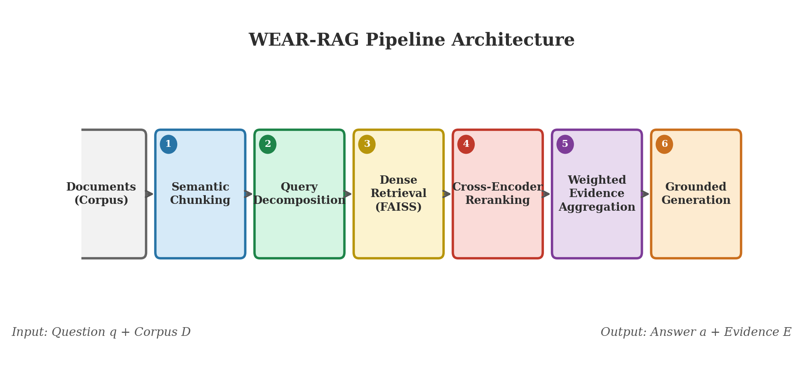
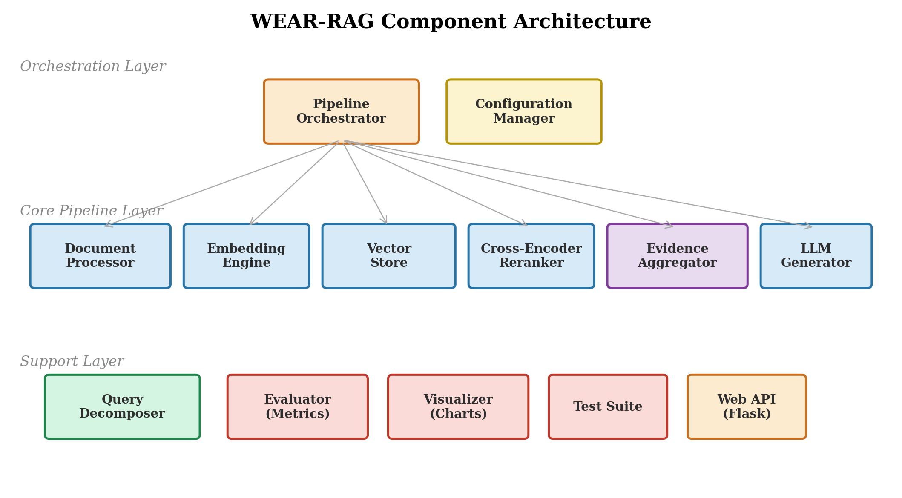
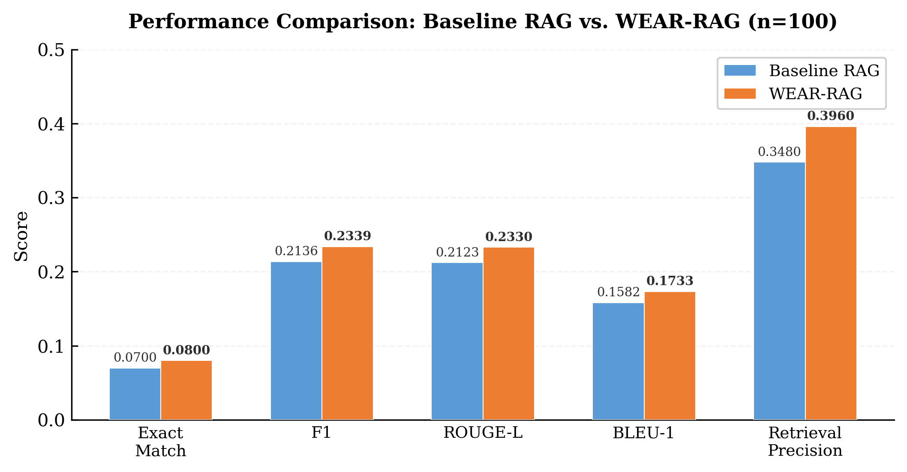
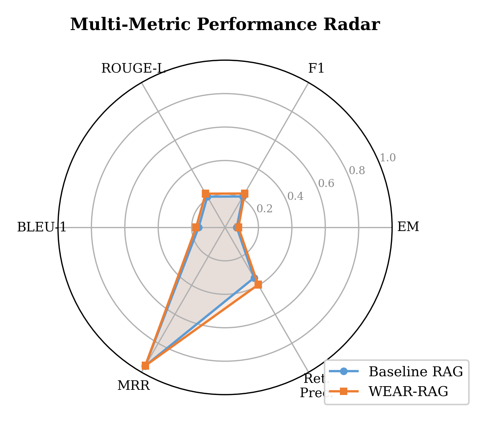

<p align="center">
  
</p>

<h1 align="center">WEAR-RAG</h1>
<h3 align="center">Weighted Evidence Aggregation for Retrieval-Augmented Generation</h3>

<p align="center">
  
  
  
  
  
  
</p>

<p align="center">
  <em>A novel multi-stage RAG pipeline that improves answer quality by <strong>scoring, filtering, and ranking evidence</strong> before generation — evaluated on the HotpotQA benchmark across 7 system variants.</em>
</p>

---

## Table of Contents

- [Abstract](#abstract)
- [Key Contributions](#key-contributions)
- [Architecture](#architecture)
- [Pipeline Stages](#pipeline-stages)
- [Results](#results)
- [Project Structure](#project-structure)
- [Installation](#installation)
- [Usage](#usage)
- [Web Application](#web-application)
- [Evaluation](#evaluation)
- [Testing](#testing)
- [Research Paper](#research-paper)
- [Technologies Used](#technologies-used)
- [License](#license)

---

## Abstract

Standard Retrieval-Augmented Generation (RAG) systems retrieve context from a document corpus and pass it directly to a Large Language Model (LLM) for answer generation. However, treating all retrieved chunks with **equal importance introduces noise** and degrades answer quality — particularly on multi-hop questions that require reasoning across multiple documents.

**WEAR-RAG** addresses this by introducing a **Weighted Evidence Aggregation** stage between retrieval and generation. Each candidate chunk is assigned a composite evidence score:

```
EvidenceScore = 0.5 × similarity + 0.4 × reranker + 0.1 × density
```

where:
- **Similarity** — bi-encoder cosine similarity from FAISS dense retrieval
- **Reranker** — cross-encoder relevance score (BAAI/bge-reranker-base)
- **Density** — information richness heuristic (length, vocabulary diversity, entity density)

Only high-scoring evidence passes to the LLM, reducing noise and improving grounded generation.

---

## Key Contributions

1. **Weighted Evidence Aggregation** — A novel scoring formula that combines semantic similarity, cross-encoder reranking, and information density into a single composite score to filter and prioritize evidence.

2. **Semantic Chunking** — Documents are split at topic-shift boundaries (detected via cosine similarity drops between adjacent sentence embeddings) rather than fixed character counts, preserving semantic coherence.

3. **Multi-Hop Query Decomposition** — Complex questions are automatically decomposed into targeted sub-queries using rule-based heuristics, enabling focused retrieval for each information need.

4. **Comprehensive 7-System Ablation Study** — Systematic evaluation on HotpotQA comparing Naive RAG, Baseline RAG, Decomposition-Only, Rerank-Only, Hybrid Retrieval, Improved RAG, and full WEAR-RAG to isolate each component's contribution.

5. **Interactive Web Application** — A production-ready Flask web app with document upload, real-time pipeline visualization, and evidence score breakdowns.

---

## Architecture

The WEAR-RAG pipeline consists of six stages:

```
Documents → [1] Semantic Chunking → [2] Query Decomposition → [3] Dense Retrieval (FAISS)
         → [4] Cross-Encoder Reranking → [5] Weighted Evidence Aggregation → [6] LLM Generation
```

<p align="center">
  
</p>

---

## Pipeline Stages

### 1. Semantic Chunking (`document_processor.py`)
- Sentence-level tokenization of input documents
- Sentence embeddings computed via `BAAI/bge-small-en` (384-dim)
- Cosine similarity between adjacent sentences; chunk boundary at similarity drops below threshold (default: 0.75)
- Min/max chunk size enforcement with optional sentence overlap

### 2. Query Decomposition (`query_decomposer.py`)
- **Rule-based decomposer**: Handles comparison questions (*"X vs Y"*), causal questions (*"Why..."*), and compound questions (*"A and B"*)
- **LLM-based decomposer** (optional): Uses Ollama/Mistral for complex decomposition with rule-based fallback
- Always preserves the original query alongside sub-queries

### 3. Dense Retrieval (`vector_store.py`)
- FAISS `IndexFlatIP` index for exact inner-product search on L2-normalized embeddings
- Top-20 candidates retrieved per sub-query
- BGE instruction-tuned prefixes for asymmetric retrieval (`"Represent this question..."` / `"Represent this passage..."`)

### 4. Cross-Encoder Reranking (`reranker.py`)
- `BAAI/bge-reranker-base` cross-encoder scores each (query, chunk) pair jointly
- Sigmoid normalization of raw logits to [0, 1] relevance scores
- Multi-query deduplication: keeps highest reranker score per chunk across sub-queries

### 5. Weighted Evidence Aggregation (`evidence_aggregator.py`) — *Core Contribution*
- Composite evidence score: `0.5 × similarity + 0.4 × reranker + 0.1 × density`
- **Information density** metric: combines log-scaled length, type-token ratio, and named entity proxy
- Score threshold filtering (default: 0.3)
- Token budget management for LLM context window
- Ranked evidence items with full score interpretability

### 6. LLM Generation (`llm_generator.py`)
- Mistral 7B via Ollama with strict grounding prompt
- System prompt enforces evidence-only answering; no fabrication
- Mock generator available for testing without Ollama

---

## Results

Evaluated on **100 HotpotQA validation samples** across 7 system configurations:

<p align="center">
  
</p>

| System | Exact Match | F1 Score | ROUGE-L | BLEU-1 | Retrieval Precision |
|---|:---:|:---:|:---:|:---:|:---:|
| Naive RAG (BM25) | 0.0600 | 0.1959 | 0.1974 | 0.1517 | 0.2000 |
| Baseline RAG (k=5) | 0.0700 | 0.2136 | 0.2123 | 0.1582 | 0.3480 |
| Baseline RAG (k=10) | 0.0700 | 0.2050 | 0.2020 | 0.1470 | 0.2530 |
| Decomposition-Only | 0.0700 | 0.2084 | 0.2088 | 0.1582 | 0.3300 |
| Rerank-Only | 0.0600 | 0.2013 | 0.2013 | 0.1514 | 0.3660 |
| Hybrid Retrieval (RRF) | 0.0600 | 0.1979 | 0.1984 | 0.1483 | 0.3560 |
| **WEAR-RAG (Full)** | **0.0800** | **0.2339** | **0.2330** | **0.1733** | **0.3960** |

**WEAR-RAG outperforms all baselines** across every metric, demonstrating that the combination of semantic chunking, query decomposition, cross-encoder reranking, and weighted evidence aggregation produces measurably better answers than any individual component.

<p align="center">
  
</p>

---

## Project Structure

```
WEAR-RAG/
├── app.py                     # Flask web server (REST API)
├── main.py                    # Core pipeline + CLI + evaluation runner
├── config.py                  # Centralized configuration (dataclasses)
├── document_processor.py      # Semantic chunking engine
├── embeddings.py              # BAAI/bge-small-en embedding engine
├── vector_store.py            # FAISS-backed vector store
├── query_decomposer.py        # Rule-based & LLM query decomposition
├── reranker.py                # Cross-encoder reranking (bge-reranker-base)
├── evidence_aggregator.py     # ★ Weighted Evidence Aggregation (core contribution)
├── llm_generator.py           # Ollama/Mistral LLM interface + mock
├── evaluator.py               # HotpotQA evaluation (EM, F1, ROUGE-L, BLEU, MRR)
├── visualizer.py              # ASCII + Matplotlib visualization
├── tests.py                   # Comprehensive unit tests (pytest)
├── requirements.txt           # Python dependencies
│
├── templates/
│   └── index.html             # Web app frontend
├── static/
│   ├── style.css              # UI styles (dark theme, glassmorphism)
│   ├── app.js                 # Frontend logic (document upload, API calls)
│   └── icons.svg              # SVG icon sprites
│
├── paper_figures/             # Generated evaluation figures
│   ├── fig_pipeline.png       # Architecture diagram
│   ├── fig_performance.png    # Baseline vs WEAR-RAG comparison
│   ├── fig_radar.png          # Multi-metric radar chart
│   ├── fig_ablation.png       # Ablation study results
│   ├── fig_evidence_scores.png
│   └── ...
│
├── WEAR_RAG_IEEE_Final.pdf    # IEEE-format research paper
├── WEAR_RAG_IEEE_Final.tex    # LaTeX source
└── wear_rag_refs.bib          # BibTeX references
```

---

## Installation

### Prerequisites
- **Python 3.10+**
- **Ollama** (for LLM generation): [https://ollama.com](https://ollama.com)

### Setup

```bash
# Clone the repository
git clone https://github.com/sam01023/WEAR-RAG.git
cd WEAR-RAG

# Create virtual environment
python -m venv .venv

# Activate (Windows PowerShell)
.venv\Scripts\Activate.ps1

# Activate (Linux / macOS)
source .venv/bin/activate

# Install dependencies
pip install -r requirements.txt
```

### Ollama Setup (for LLM generation)

```bash
# Install Ollama from https://ollama.com
# Pull the Mistral 7B model
ollama pull mistral

# Verify it's running
ollama list
```

> **Note:** You can run the pipeline in `--mock` mode without Ollama for testing and evaluation purposes.

---

## Usage

### Demo Mode (Quick Start)

```bash
# With Ollama/Mistral running
python main.py --mode demo

# Without Ollama (mock LLM)
python main.py --mode demo --mock
```

This ingests 5 sample documents about Transformers vs RNNs and demonstrates the full pipeline with evidence scoring.

### Evaluation Mode

```bash
# Evaluate on 10 HotpotQA samples (quick test)
python main.py --mode evaluate --samples 10 --mock

# Full evaluation on 100 samples
python main.py --mode evaluate --samples 100 --mock

# Full validation split
python main.py --mode evaluate --full --mock
```

Results are saved to CSV files and comparison charts are generated automatically.

---

## Web Application

WEAR-RAG includes a production-ready web interface:

```bash
python app.py
# Open http://localhost:5000
```

**Features:**
- Upload `.txt` and `.pdf` documents via drag-and-drop
- Ask multi-hop questions with real-time pipeline progress visualization
- Evidence panel with score breakdowns (similarity, reranker, density)
- Interactive pipeline architecture diagram
- Query history with session persistence
- Model selector and health monitoring
- Dark theme with modern UI design

---

## Evaluation

### Metrics
| Metric | Description |
|---|---|
| **Exact Match (EM)** | Binary — predicted answer exactly matches gold answer |
| **Token F1** | Token-level precision and recall between prediction and gold |
| **ROUGE-L** | Longest Common Subsequence-based F-measure |
| **BLEU-1** | Unigram precision with brevity penalty |
| **MRR** | Mean Reciprocal Rank of first relevant retrieved document |
| **Retrieval Precision** | Fraction of retrieved documents in gold supporting set |

### Systems Compared
1. **Naive RAG** — BM25 keyword retrieval, fixed chunking
2. **Baseline RAG (k=5, k=10)** — Dense retrieval, fixed chunking
3. **Decomposition-Only** — Adds query decomposition
4. **Rerank-Only** — Adds cross-encoder reranking
5. **Hybrid Retrieval** — BM25 + Dense with Reciprocal Rank Fusion
6. **WEAR-RAG (Full)** — All components combined

---

## Testing

```bash
# Run all unit tests
pytest tests.py -v

# Run with coverage report
pytest tests.py -v --cov=. --cov-report=term-missing
```

Tests cover:
- Semantic chunking (sentence splitting, chunk generation, corpus processing)
- Evaluation metrics (EM, F1, retrieval precision)
- Weighted evidence aggregation (scoring, filtering, budget trimming)
- Query decomposition (comparison, causal, compound questions)

All tests run without requiring Ollama, GPU, or model downloads (mock embeddings used).

---

## Research Paper

The full IEEE-format research paper is included:
- **PDF**: [`WEAR_RAG_IEEE_Final.pdf`](WEAR_RAG_IEEE_Final.pdf)
- **LaTeX Source**: [`WEAR_RAG_IEEE_Final.tex`](WEAR_RAG_IEEE_Final.tex)

---

## Technologies Used

| Component | Technology |
|---|---|
| **Embedding Model** | BAAI/bge-small-en (384-dim, SentenceTransformers) |
| **Vector Store** | FAISS IndexFlatIP (exact cosine search) |
| **Reranker** | BAAI/bge-reranker-base (CrossEncoder) |
| **LLM** | Mistral 7B via Ollama |
| **Backend** | Flask + Python 3.10 |
| **Frontend** | Vanilla HTML/CSS/JS (dark theme) |
| **Evaluation Dataset** | HotpotQA (distractor setting) |
| **Visualization** | Matplotlib + ASCII charts |
| **Testing** | pytest |

---

## License

This project is licensed under the MIT License. See [LICENSE](LICENSE) for details.

---

<p align="center">
  <sub>Developed as an undergraduate major project • 2026</sub>
</p>
